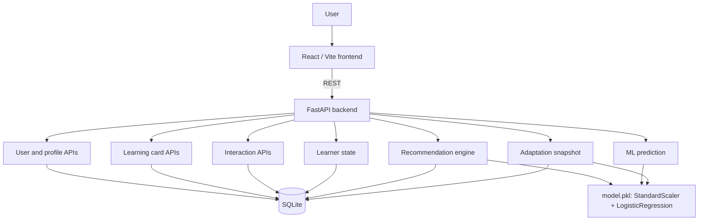
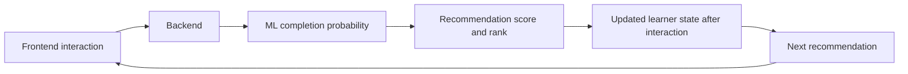
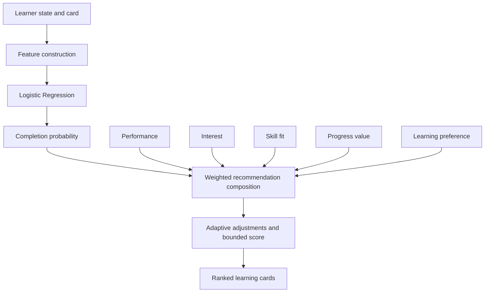
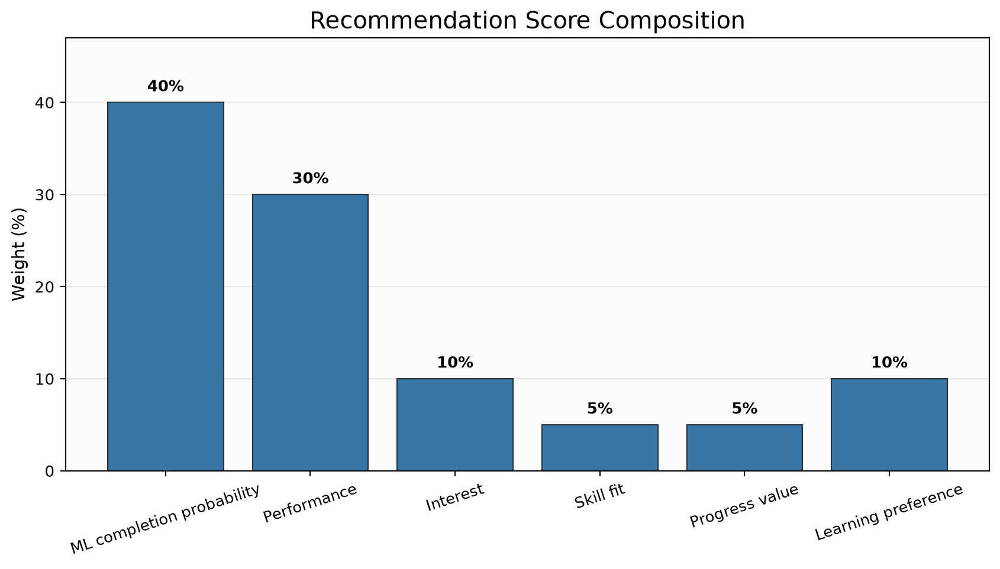
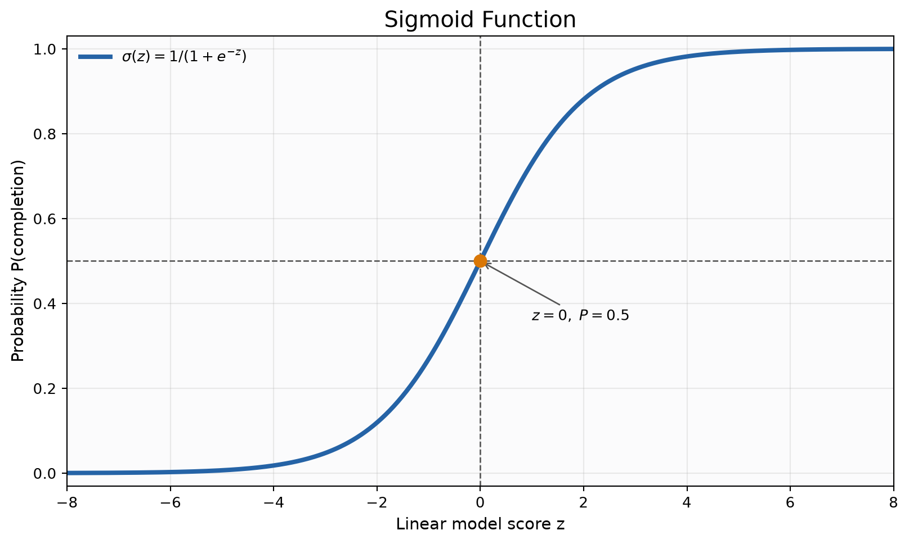
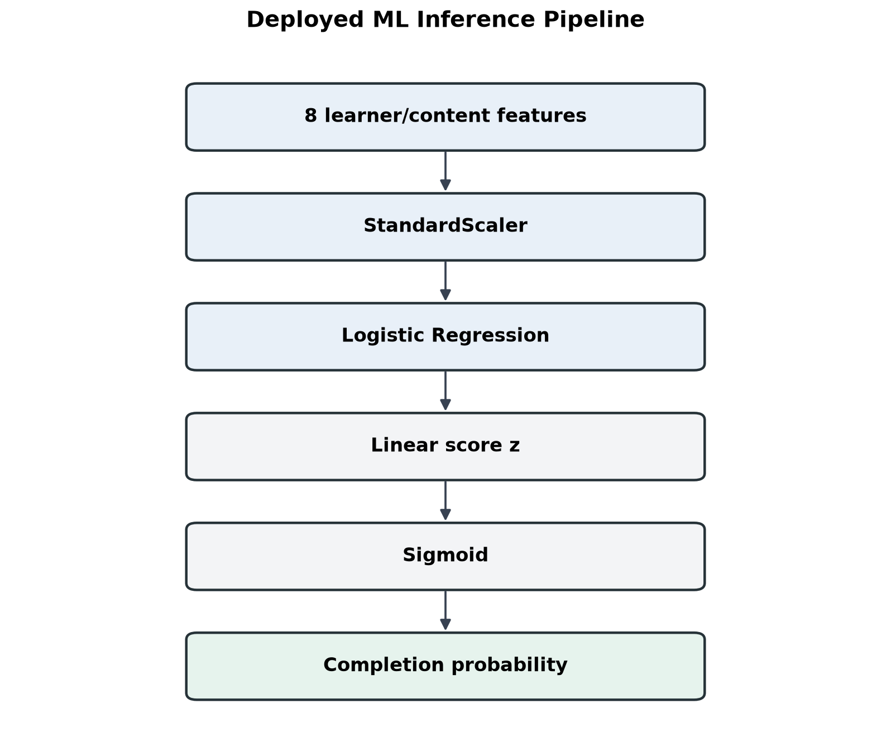
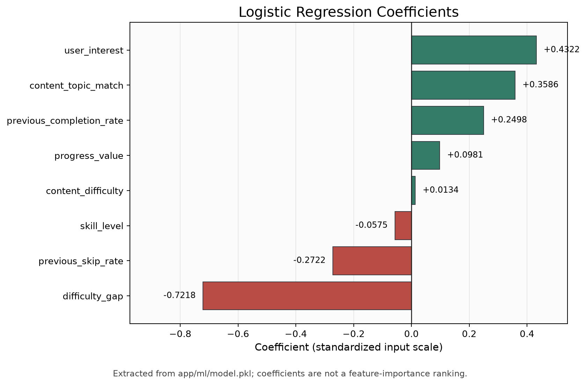
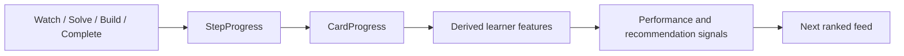

# Vinayoki Backend

> Turning Infinite Scroll Into Real-World Progress

Vinayoki is an adaptive learning recommendation system that turns short bursts of attention into measurable learning and career progress. The backend serves learning content, records interactions, maintains learner state, predicts completion probability, and ranks the next learning cards.

**Core loop:** Watch → Solve → Build → Measure → Adapt → Recommend

## Problem

Short-form feeds are commonly optimized for continued attention. Vinayoki focuses on meaningful learning actions instead: learners watch a concise explanation, solve a question, or build a small artifact. The backend records those interactions and updates progress signals. Recommendation decisions combine a Logistic Regression completion-probability estimate with performance, interest, skill fit, progress value, and learning preference signals.

## System architecture





## Backend stack

| Technology | Role |
| --- | --- |
| Python | Backend and model-serving runtime |
| FastAPI | REST API and dependency-based request handling |
| SQLAlchemy | ORM and SQLite persistence |
| SQLite | Prototype relational database |
| pandas | Constructing the single-row inference frame |
| scikit-learn | `StandardScaler` and `LogisticRegression` pipeline |
| joblib | Loading `app/ml/model.pkl` |
| REST | Frontend/backend interface |

## Project structure

```text
app/
├── main.py                 FastAPI app, startup loaders, middleware, router registration
├── database.py             SQLite engine, session factory, Base, get_db dependency
├── models.py               SQLAlchemy entities for users, content, cards, progress, history
├── schemas.py              Pydantic request/response schemas
├── load_content.py         Idempotent initial loader for legacy content.json
├── load_learning_cards.py  Initial loader for learning_cards.json
├── routes/                 User, feed, card, interaction, stats, ML, state, adaptation APIs
├── services/               Recommender, card ranking, progress, engagement, user state
└── ml/
    ├── features.py         Builds current learner/card features
    ├── train.py             Prototype model training script
    └── model.pkl            Deployed 8-feature sklearn pipeline

data/
├── content.json             Legacy feed content
├── learning_cards.json      Structured card/step content
├── interactions.csv         Generated prototype training data
└── generate_dataset.py      Synthetic interaction-data generator
```

`app/main.py` creates tables through `Base.metadata.create_all`, loads legacy and card content at startup, and registers all routers. Loaders skip insertion when their respective content table is already populated. `app/ml/features.py` returns eight inference features plus five adaptive signals. `app/services/card_recommender.py` predicts completion probability and applies the separate weighted ranking formula. The checked-in model artifact is loaded from a path relative to that service module.

## Recommendation architecture

The base recommendation score is:

\[
\begin{aligned}
S_{base} ={}& 0.40 P_{completion}
 + 0.30 S_{performance}
 + 0.10 S_{interest} \\
 &+ 0.05 S_{skill-fit}
 + 0.05 S_{progress}
 + 0.10 S_{preference}
\end{aligned}
\]

The terms are computed by `get_card_recommendations()` in `app/services/card_recommender.py`. Adaptive adjustments are then applied and the final value is clipped to `[0, 1]`; results are sorted descending and the requested number of cards is returned.





## Machine learning model

The deployed completion model is the checked-in scikit-learn pipeline:

```python
Pipeline([
    ("scaler", StandardScaler()),
    ("classifier", LogisticRegression(...)),
])
```

The model is a binary completion predictor. Logistic Regression is suitable for this lightweight prototype because it estimates a probability, has a compact inference path, and exposes coefficients that can be inspected. It is not a neural network, deep-learning model, or reinforcement-learning system.

### Exact model features

`model.pkl` exposes eight inputs in this exact order:

| Order | Feature |
| ---: | --- |
| 1 | `user_interest` |
| 2 | `skill_level` |
| 3 | `content_difficulty` |
| 4 | `content_topic_match` |
| 5 | `previous_completion_rate` |
| 6 | `previous_skip_rate` |
| 7 | `difficulty_gap` |
| 8 | `progress_value` |

The five additional adaptive signals produced by feature construction—`mastery_score`, `accuracy_score`, `time_efficiency`, `build_score`, and `attempt_count`—are used by the recommendation/adaptation layer, but **are not direct inputs to the deployed Logistic Regression artifact**. The current training script declares a 13-feature list, whereas `model.pkl` uses the eight names above. The checked-in CSV currently contains nine columns and does not contain the five adaptive columns required by that training script. These definitions need alignment before the existing training script can reproduce the deployed artifact.

### Logistic Regression mathematics

For standardized input vector \(x\), the classifier computes the linear score:

\[
z = w_1x_1 + w_2x_2 + \cdots + w_8x_8 + b
\]

The sigmoid maps that score to an estimated completion probability:

\[
P(\text{completion}) = \sigma(z) = \frac{1}{1 + e^{-z}}
\]

`z` can be any real number; the sigmoid maps it into `[0, 1]`. A threshold of `0.5` is the conventional binary classification boundary. The recommendation layer uses the continuous probability value in its score rather than reducing it to only a completed/not-completed label.





### Coefficients from the deployed artifact

The chart below is extracted from the actual `app/ml/model.pkl` classifier and mapped to its exposed feature names. Since `StandardScaler` precedes Logistic Regression, the coefficients refer to standardized inputs. A positive coefficient increases the model's completion log-odds when that standardized feature increases and other standardized inputs are held constant; a negative coefficient decreases them. These are Logistic Regression coefficients, not a general feature-importance ranking or causal effects.



### Model evaluation status

The training script contains a random train/test split, but its current 13-feature input list does not match the checked-in nine-column CSV or the deployed eight-feature artifact. The data generator explicitly simulates interactions, and the present artifact's training provenance is not represented by a reproducible, aligned evaluation protocol in this repository. **Model evaluation metrics are not currently reported because the deployed artifact was trained from the current prototype dataset without a documented held-out evaluation protocol.** The training script's metrics should not be read as validation of the deployed artifact.

### Verified prediction example

For the local verified demo record:

| User | Card | Current artifact prediction |
| ---: | --- | ---: |
| 5 | 3 — Python Functions | `0.5587232669878504` (approximately `55.87%`) |

This is the model-estimated probability of completion for that learner/card feature vector. It does not guarantee whether the learner will complete the card.

## Adaptive recommendation layer

The performance component is computed as:

\[
S_{performance} = 0.40M + 0.25A + 0.20B + 0.15T
\]

where \(M\) is `mastery_score`, \(A\) is `accuracy_score`, \(B\) is `build_score`, and \(T\) is `time_efficiency`. The current additional adjustments in `card_recommender.py` are:

- Existing mastery below `0.60`: add `0.05`.
- Existing mastery from `0.60` up to (but below) `0.80`: add `0.025`.
- `needs_revision` is true: add `0.05`.
- Difficulty adjustment: subtract `0.025 × difficulty_gap`.
- Clamp the resulting score to `[0, 1]`.

Cards with mastery at least `0.80` and no revision flag are normally excluded before scoring.

## Cold-start behavior

For a user with no matching `UserSkill`, `build_card_features()` uses:

| Feature | Current default |
| --- | ---: |
| `user_interest` | `0.5` |
| `skill_level` | `0.3` |
| `previous_completion_rate` | `0.0` |
| `previous_skip_rate` | `0.0` |
| `content_topic_match` | Same value as `user_interest` (`0.5`) |

The expected difficulty is derived from `skill_level`: below `0.40` maps to level 1, below `0.70` maps to level 2, otherwise level 3. `difficulty_gap` is the absolute difference between card difficulty and that expected level. `content_difficulty` and `progress_value` come from the card. With no `CardProgress`, mastery, accuracy, time efficiency, build score, and attempt count are all `0.0`/`0` respectively. In the ranking layer, a missing `UserSkill` uses neutral `0.5` values for interest and skill fit. A missing preference record uses `0.25` per stored watch/solve/build/explore preference; the score uses the watch/solve/build stage proportions and their preference weights.

## Interaction feedback loop



Watch marks a watch step complete and updates time/attempt tracking. Solve records correctness and question counts. Build records a bounded build score and completion. A `complete` action marks the progress row complete. These signals are stored separately and feed later learner-state and recommendation calculations.

## Adaptation snapshot

`GET /adaptation/{user_id}/{card_id}` is read-only. It returns the selected card's current learner-state signals, ML completion probability, recommendation score, and rank (when rank data is available). It queries progress directly and does not call the card-detail route that can create progress rows. The endpoint supports observing the Before → Interaction → After adaptation loop.

## API endpoints

| Method | Route | Purpose | Persistence behavior |
| --- | --- | --- | --- |
| `GET` | `/cards/feed/{user_id}` | Return the ranked card feed | **Persists RecommendationHistory rows** for that generated feed session |
| `GET` | `/cards/{card_id}?user_id={user_id}` | Return card, steps, and progress | May create a `CardProgress` row if none exists |
| `GET` | `/learner-state/{user_id}` | Read profile, skill records, and progress metrics | Read-only |
| `GET` | `/recommendations/history/{user_id}` | Read stored recommendation decisions, newest first | Read-only |
| `GET` | `/ml/prediction/{user_id}/{card_id}` | Read model inputs, adaptive signals, metadata, and probability | Read-only |
| `GET` | `/adaptation/{user_id}/{card_id}` | Read current learner/ML/recommendation snapshot | Read-only |
| `GET` | `/engagement/{user_id}` | Read recent engagement/intervention status | Read-only |
| `GET` | `/stats/{user_id}` | Read card/step time and completion aggregates | Read-only |
| `GET` | `/feed/{user_id}` | Legacy personalized activity feed | Read-only in the current route |
| `POST` | `/users/` | Create user and learning preferences | Mutates database |
| `POST` | `/interactions/` | Record a legacy content interaction | Mutates interaction and user-skill state |
| `POST` | `/card-interactions/` | Record a card step interaction | Mutates step/card progress |

All route paths above are registered by `app/main.py`. `GET /cards/feed/{user_id}` is intentionally called out because it has a write side effect in the current implementation.

## Database entities

| Entity/table | Role |
| --- | --- |
| `User` / `users` | Learner profile fields: name, goal, level, and learning style |
| `UserSkill` / `user_skills` | Per-skill interest, skill, completion, and skip signals |
| `LearningPreferences` / `learning_preferences` | Relative watch, solve, build, and explore preferences |
| `LearningCard` / `learning_cards` | Structured learning card metadata |
| `LearningStep` / `learning_steps` | Ordered watch/solve/build content for a card |
| `CardProgress` / `card_progress` | Per-user, per-card progress and summary scores |
| `StepProgress` / `step_progress` | Per-user, per-step completion, correctness, attempts, and time |
| `RecommendationHistory` / `recommendation_history` | Per-feed-session card rank and component/final scores |
| `Content` / `content` | Legacy activity catalog |
| `Interaction` / `interactions` | Legacy interaction records |

## Deployment

The backend is deployed on Render. The expected process command is:

```bash
uvicorn app.main:app --host 0.0.0.0 --port $PORT
```

`DATABASE_URL` is not currently configured: `app/database.py` uses `sqlite:///./vinayoki.db`. Render's default filesystem is ephemeral, so database changes can be lost when an instance is replaced or restarted. This storage setup is suitable for a prototype/demo, not durable production persistence. The application loads content JSON on startup when the corresponding database table is empty. `app/ml/model.pkl` is a repository artifact loaded by the backend at inference time.

## Limitations

- The deployed completion model consumes eight features; five adaptive signals are outside the current estimator.
- The current feature builder sets `content_topic_match` equal to `user_interest`; this is the implementation's current feature construction, not an independent semantic similarity calculation.
- The current checked-in synthetic training data, 13-column training feature list, and eight-input model artifact are not aligned.
- SQLite on Render's default filesystem is ephemeral.
- No reproducible, documented held-out evaluation metrics are reported for the deployed artifact.
- Recommendation history is written when the card feed is generated, including feed loads that might not ultimately be displayed.
- Dataset generation uses simulated interaction records; the repository does not establish that the deployed model was trained on production-scale real learner outcomes.

## Future ML work

Potential next steps, not implemented here:

- Collect consented real interaction outcomes.
- Align training and inference feature definitions and order.
- Decide whether adaptive features belong in a retrained artifact.
- Establish reproducible train/validation/test splits at the learner or interaction level.
- Evaluate ROC-AUC, precision, recall, and probability calibration on held-out data.
- Compare an unpersonalized baseline with the current personalized ranking.
- Consider ranking-specific models only after enough relevant data is available.
- Monitor recommendation quality and data drift over time.
